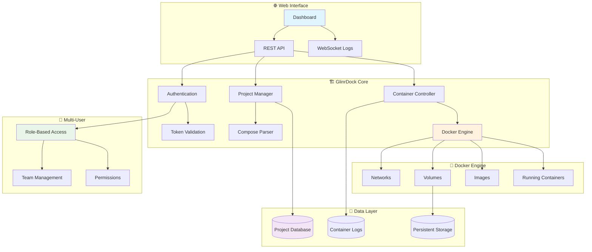

# 🐳 GlinrDock

**Lightweight, Secure Container Management Platform**

[](https://github.com/GLINCKER/glinrdock-release/releases)
[](https://ghcr.io/glincker/glinrdock)
[](LICENSE)
[](docs/SECURITY.md)

GlinrDock is a production-ready container management platform that combines the simplicity of Docker Compose with enterprise-grade features. Built for teams who need powerful container orchestration without the complexity of Kubernetes.

## 🚀 What is GlinrDock?



## ✨ Key Features

- **🎯 Simple Yet Powerful** - Docker Compose compatibility with advanced orchestration
- **🔒 Security First** - Hardened defaults, RBAC, audit logging
- **📊 Real-time Monitoring** - Live metrics, logs, and resource tracking  
- **🔄 Zero-Downtime Deployments** - Rolling updates and health checks
- **👥 Team Collaboration** - Multi-user support with fine-grained permissions
- **📦 Multi-Architecture** - Native support for AMD64 and ARM64
- **🛡️ Production Ready** - Comprehensive security scanning and SLSA provenance

This repository contains release binaries, installation scripts, and documentation for GlinrDock. The source code is maintained in a separate private repository.

## 🚀 Quick Start

### 1-Click Install (Recommended)
```bash
curl -fsSL https://github.com/GLINCKER/glinrdock-release/releases/latest/download/install.sh | sudo bash
```

### Container Deployment
```bash
# Pull and run the latest container
docker run -d \
  --name glinrdock \
  --restart unless-stopped \
  -p 8080:8080 \
  -v /var/run/docker.sock:/var/run/docker.sock \
  -v glinrdock_data:/data \
  ghcr.io/glincker/glinrdock:latest
```

### Docker Compose
```yaml
# docker-compose.yml
version: '3.8'
services:
  glinrdock:
    image: ghcr.io/glincker/glinrdock:latest
    container_name: glinrdock
    restart: unless-stopped
    ports:
      - "8080:8080"
    volumes:
      - /var/run/docker.sock:/var/run/docker.sock
      - glinrdock_data:/data
    environment:
      - GLINRDOCK_LOG_LEVEL=info
volumes:
  glinrdock_data:
```

### 🎯 First Steps
1. **Access Dashboard**: http://localhost:8080
2. **Get Admin Token**: Check installation output or logs
3. **Login & Deploy**: Create your first container project!

> 📖 **New to GlinrDock?** Follow our [5-minute Quick Start Guide](QUICKSTART.md)

## 📚 Documentation

| Category | Links |
|----------|--------|
| **🏗️ Setup** | [Installation](docs/INSTALL.md) • [Configuration](docs/CONFIG.md) • [Upgrade](docs/UPGRADE.md) |
| **🔒 Security** | [Security Guide](docs/SECURITY.md) • [Verification](docs/VERIFY.md) • [Best Practices](docs/SECURITY.md#best-practices) |
| **🛠️ Operations** | [Quick Start](QUICKSTART.md) • [Troubleshooting](docs/TROUBLESHOOTING.md) • [FAQ](docs/FAQ.md) |
| **📖 Reference** | [Release Process](docs/RELEASE_PROCESS.md) • [Support](docs/SUPPORT.md) • [Complete Index](docs/index.md) |

## 📦 Release Artifacts

### Supported Platforms
| Platform | Architecture | Download |
|----------|--------------|----------|
| **Linux** | AMD64 | `glinrdockd_linux_amd64.tar.gz` |
| **Linux** | ARM64 | `glinrdockd_linux_arm64.tar.gz` |
| **macOS** | Intel | `glinrdockd_darwin_amd64.tar.gz` |
| **macOS** | Apple Silicon | `glinrdockd_darwin_arm64.tar.gz` |

### Container Images
```bash
# Latest stable release
docker pull ghcr.io/glincker/glinrdock:latest

# Specific version
docker pull ghcr.io/glincker/glinrdock:v1.0.0
```

### 🛡️ Verification
All releases include SHA256 checksums and security scanning:
```bash
# Download and verify
curl -LO https://github.com/GLINCKER/glinrdock-release/releases/latest/download/glinrdockd_linux_amd64.tar.gz
curl -LO https://github.com/GLINCKER/glinrdock-release/releases/latest/download/SHA256SUMS
sha256sum -c SHA256SUMS --ignore-missing
```

## 💡 Use Cases

### 🏢 **Enterprise Teams**
- Multi-tenant container hosting
- Team-based project isolation
- RBAC and audit logging
- Integration with existing CI/CD

### 🚀 **Development Teams**
- Simplified Docker Compose workflows  
- Real-time collaboration
- Environment consistency
- Zero-config deployments

### ☁️ **DevOps Engineers**
- Container fleet management
- Resource monitoring & alerts
- Rolling deployments
- Infrastructure as Code

## 🆚 Why Choose GlinrDock?

| Feature | GlinrDock | Docker Compose | Kubernetes |
|---------|-----------|----------------|------------|
| **Learning Curve** | ✅ Minutes | ✅ Hours | ❌ Weeks |
| **Resource Usage** | ✅ Minimal | ✅ Minimal | ❌ Heavy |
| **Multi-User** | ✅ Built-in | ❌ Manual | ✅ Complex |
| **Web UI** | ✅ Intuitive | ❌ None | ❌ Complex |
| **Production Ready** | ✅ Yes | ⚠️ Limited | ✅ Yes |
| **Setup Time** | ✅ 30 seconds | ✅ 5 minutes | ❌ Hours |

## 🏆 System Requirements

| Component | Minimum | Recommended |
|-----------|---------|-------------|
| **OS** | Linux 3.10+ / macOS 10.15+ | Linux 5.4+ / macOS 12+ |
| **Memory** | 512MB | 2GB+ |
| **Storage** | 1GB | 10GB+ |
| **Docker** | 20.10+ | 24.0+ |
| **Network** | Port 8080 | Reverse proxy ready |

## 🤝 Support & Community

- 🐛 **Bug Reports**: [GitHub Issues](https://github.com/GLINCKER/glinrdock-release/issues)
- 💬 **Discussions**: [GitHub Discussions](https://github.com/GLINCKER/glinrdock-release/discussions)
- 🔒 **Security**: [Security Policy](docs/SECURITY.md)
- 📧 **Enterprise**: contact@glinr.dev

## 📄 License

This project is licensed under the MIT License - see the [LICENSE](LICENSE) file for details.

---

**⚡ Ready to simplify your container management?** [Get started in 30 seconds →](QUICKSTART.md)

> 🔒 **Security Notice**: This is a public binary distribution repository. Source code is maintained separately for security reasons.