# GlinrDock

> **🚧 COMING SOON** - Currently in development. Star this repo to get notified when we launch!

**Lightweight, Secure Container Management Platform**

[](https://github.com/GLINCKER/glinrdock-release/releases)
[](https://ghcr.io/glincker/glinrdock)
[](LICENSE)
[](docs/SECURITY.md)

GlinrDock is a production-ready container management platform that combines the simplicity of Docker Compose with enterprise-grade features. Built for teams who need powerful container orchestration without the complexity of Kubernetes.

## Why Choose GlinrDock?

### Developer Journey: From Complexity to Productivity


### GlinrDock vs The Competition

#### The Container Management Landscape in 2025

```mermaid
flowchart TB
    Problem["😤 Container Management Challenge<br/>Choose Your Poison"] --> Choice{What's Your Priority?}
    
    Choice -->|"Simplicity<br/>Single Host"| Docker["🐳 Docker Compose<br/>✅ Easy YAML config<br/>❌ No web interface<br/>❌ Single host only<br/>❌ No team features<br/>⏱️ Setup: 5 mins"]
    
    Choice -->|"Enterprise Scale<br/>Full Control"| K8s["⚙️ Kubernetes<br/>✅ Unlimited scalability<br/>✅ Production features<br/>❌ Steep learning curve<br/>❌ Resource hungry<br/>⏱️ Setup: Days/Weeks"]
    
    Choice -->|"UI + Docker<br/>Basic Management"| Portainer["📊 Portainer<br/>✅ Nice Docker UI<br/>✅ Community support<br/>❌ Limited scalability<br/>❌ Basic team features<br/>⏱️ Setup: 15 mins"]
    
    Choice -->|"Multi-Cluster<br/>K8s Management"| Rancher["🎛️ Rancher<br/>✅ Multi-cluster K8s<br/>✅ Enterprise features<br/>❌ K8s complexity<br/>❌ Resource intensive<br/>⏱️ Setup: Hours"]
    
    Choice -->|"Perfect Balance<br/>Smart Choice"| GlinrDock["🚀 GlinrDock<br/>✅ Docker Compose compatible<br/>✅ Beautiful web interface<br/>✅ Team collaboration<br/>✅ Zero-downtime deploys<br/>✅ Production ready<br/>⏱️ Setup: 30 seconds"]
    
    Docker --> DockerPain["😞<br/>• Manual deployments<br/>• No collaboration<br/>• Production anxiety"]
    K8s --> K8sPain["🤯<br/>• Configuration hell<br/>• Months to master<br/>• Overkill for most"]  
    Portainer --> PortainerPain["😐<br/>• Scalability limits<br/>• Docker-only focus<br/>• Basic workflows"]
    Rancher --> RancherPain["😓<br/>• K8s prerequisite<br/>• Complex architecture<br/>• Heavy resource usage"]
    GlinrDock --> Success["🎉 Developer Happiness<br/>• Fast deployments<br/>• Team productivity<br/>• Confident scaling"]
    
    style GlinrDock fill:#4caf50,stroke:#2e7d32,color:#fff
    style Docker fill:#ffc107,stroke:#f57f17,color:#000
    style K8s fill:#ff5722,stroke:#d84315,color:#fff
    style Portainer fill:#2196f3,stroke:#1565c0,color:#fff
    style Rancher fill:#9c27b0,stroke:#6a1b9a,color:#fff
    style Success fill:#4caf50,stroke:#2e7d32,color:#fff
```



#### Feature Comparison Matrix

| Feature | Docker Compose | Portainer | Kubernetes | Rancher | **GlinrDock** |
|---------|----------------|-----------|------------|---------|---------------|
| **Setup Time** | 5 minutes | 15 minutes | Days | Hours | **30 seconds** |
| **Learning Curve** | Easy | Easy | Steep | Moderate | **Easy** |
| **Web Interface** | ❌ None | ✅ Basic | ❌ Complex | ✅ Advanced | **🎯 Intuitive** |
| **Multi-User** | ❌ Manual | ⚠️ Basic | ✅ RBAC | ✅ Enterprise | **✅ Built-in** |
| **Team Collaboration** | ❌ None | ⚠️ Limited | ⚠️ Complex | ✅ Yes | **🚀 Native** |
| **Production Ready** | ⚠️ Limited | ⚠️ Limited | ✅ Yes | ✅ Yes | **✅ Day One** |
| **Resource Usage** | Light | Light | Heavy | Heavy | **Light** |
| **Scaling** | ❌ Manual | ⚠️ Limited | ✅ Auto | ✅ Auto | **✅ Smart** |
| **Zero-Downtime** | ❌ No | ❌ No | ✅ Yes | ✅ Yes | **✅ Built-in** |
| **Monitoring** | ❌ External | ⚠️ Basic | ⚠️ Complex | ✅ Yes | **📊 Real-time** |
| **Cost** | Free | Free/Paid | Infrastructure | License | **💰 Fair** |

#### Real-World Impact Comparison

```mermaid
graph TB
    subgraph "📊 Deployment Time"
        DC[Docker Compose<br/>2 hours → 5 minutes<br/>-75% time]
        PO[Portainer<br/>2 hours → 30 minutes<br/>-75% time]  
        K8[Kubernetes<br/>Days → Hours<br/>-80% time]
        RA[Rancher<br/>Hours → 1 hour<br/>-50% time]
        GD[GlinrDock<br/>2 hours → 30 seconds<br/>-99% time]
    end
    
    subgraph "👥 Team Adoption"
        DC2[Docker Compose<br/>Manual handoffs<br/>Deployment bottlenecks]
        PO2[Portainer<br/>Basic sharing<br/>Limited workflows]
        K82[Kubernetes<br/>Requires experts<br/>Slow adoption]
        RA2[Rancher<br/>K8s knowledge needed<br/>Training required]
        GD2[GlinrDock<br/>Instant collaboration<br/>Anyone can deploy]
    end
    
    subgraph "🚀 Developer Experience"
        DC3[Docker Compose<br/>CLI only<br/>Context switching]
        PO3[Portainer<br/>Basic UI<br/>Docker-focused]
        K83[Kubernetes<br/>YAML hell<br/>Complex debugging]
        RA3[Rancher<br/>Feature-rich<br/>K8s complexity]
        GD3[GlinrDock<br/>Intuitive workflows<br/>Compose compatible]
    end
    
    style GD fill:#4caf50,stroke:#2e7d32,color:#fff
    style GD2 fill:#4caf50,stroke:#2e7d32,color:#fff  
    style GD3 fill:#4caf50,stroke:#2e7d32,color:#fff
```



### What Makes GlinrDock Different

```mermaid
mindmap
  root)🚀 GlinrDock(
    🎯 Developer Experience
      30s Install
      Intuitive UI  
      Docker Compose Compatible
      Live Log Streaming
    🔒 Security First
      RBAC Built-in
      Audit Logging
      Hardened Defaults
      Vulnerability Scanning
    👥 Team Collaboration
      Multi-tenant Projects
      Fine-grained Permissions
      Real-time Updates
      Activity Feeds
    🔄 Production Ready
      Zero-downtime Deployments
      Health Checks
      Auto-scaling
      Rolling Updates
    📊 Monitoring & Insights
      Resource Usage
      Performance Metrics  
      Alert Systems
      Container Logs
```



## Key Features

- **Simple Yet Powerful** - Docker Compose compatibility with advanced orchestration
- **Security First** - Hardened defaults, RBAC, audit logging
- **Real-time Monitoring** - Live metrics, logs, and resource tracking  
- **Zero-Downtime Deployments** - Rolling updates and health checks
- **Team Collaboration** - Multi-user support with fine-grained permissions
- **Multi-Architecture** - Native support for AMD64 and ARM64
- **Production Ready** - Comprehensive security scanning and SLSA provenance

This repository contains release binaries, installation scripts, and documentation for GlinrDock. The source code is maintained in a separate private repository.

## Quick Start

### 1-Click Install (Recommended)
```bash
curl -fsSL https://github.com/GLINCKER/glinrdock-release/releases/latest/download/install.sh | sudo bash
```

### Container Deployment
```bash
# Pull and run the latest container
docker run -d \
  --name glinrdock \
  --restart unless-stopped \
  -p 8080:8080 \
  -v /var/run/docker.sock:/var/run/docker.sock \
  -v glinrdock_data:/data \
  ghcr.io/glincker/glinrdock:latest
```

### Docker Compose
```yaml
# docker-compose.yml
version: '3.8'
services:
  glinrdock:
    image: ghcr.io/glincker/glinrdock:latest
    container_name: glinrdock
    restart: unless-stopped
    ports:
      - "8080:8080"
    volumes:
      - /var/run/docker.sock:/var/run/docker.sock
      - glinrdock_data:/data
    environment:
      - GLINRDOCK_LOG_LEVEL=info
volumes:
  glinrdock_data:
```

### First Steps
1. **Access Dashboard**: http://localhost:8080
2. **Get Admin Token**: Check installation output or logs
3. **Login & Deploy**: Create your first container project!

> 📖 **New to GlinrDock?** Follow our [5-minute Quick Start Guide](QUICKSTART.md)

## Documentation

| Category | Links |
|----------|--------|
| **🏗️ Setup** | [Installation](docs/INSTALL.md) • [Configuration](docs/CONFIG.md) • [Upgrade](docs/UPGRADE.md) |
| **🔒 Security** | [Security Guide](docs/SECURITY.md) • [Verification](docs/VERIFY.md) • [Best Practices](docs/SECURITY.md#best-practices) |
| **🛠️ Operations** | [Quick Start](QUICKSTART.md) • [Troubleshooting](docs/TROUBLESHOOTING.md) • [FAQ](docs/FAQ.md) |
| **📖 Reference** | [Release Process](docs/RELEASE_PROCESS.md) • [Support](docs/SUPPORT.md) • [Complete Index](docs/index.md) |

## Release Artifacts

### Supported Platforms
| Platform | Architecture | Download |
|----------|--------------|----------|
| **Linux** | AMD64 | `glinrdockd_linux_amd64.tar.gz` |
| **Linux** | ARM64 | `glinrdockd_linux_arm64.tar.gz` |
| **macOS** | Intel | `glinrdockd_darwin_amd64.tar.gz` |
| **macOS** | Apple Silicon | `glinrdockd_darwin_arm64.tar.gz` |

### Container Images
```bash
# Latest stable release
docker pull ghcr.io/glincker/glinrdock:latest

# Specific version
docker pull ghcr.io/glincker/glinrdock:v1.0.0
```

### Verification
All releases include SHA256 checksums and security scanning:
```bash
# Download and verify
curl -LO https://github.com/GLINCKER/glinrdock-release/releases/latest/download/glinrdockd_linux_amd64.tar.gz
curl -LO https://github.com/GLINCKER/glinrdock-release/releases/latest/download/SHA256SUMS
sha256sum -c SHA256SUMS --ignore-missing
```

## Use Cases

### Enterprise Teams
- Multi-tenant container hosting
- Team-based project isolation
- RBAC and audit logging
- Integration with existing CI/CD

### Development Teams
- Simplified Docker Compose workflows  
- Real-time collaboration
- Environment consistency
- Zero-config deployments

### DevOps Engineers
- Container fleet management
- Resource monitoring & alerts
- Rolling deployments
- Infrastructure as Code

## Comparison Overview

| Feature | GlinrDock | Docker Compose | Kubernetes |
|---------|-----------|----------------|------------|
| **Learning Curve** | ✅ Minutes | ✅ Hours | ❌ Weeks |
| **Resource Usage** | ✅ Minimal | ✅ Minimal | ❌ Heavy |
| **Multi-User** | ✅ Built-in | ❌ Manual | ✅ Complex |
| **Web UI** | ✅ Intuitive | ❌ None | ❌ Complex |
| **Production Ready** | ✅ Yes | ⚠️ Limited | ✅ Yes |
| **Setup Time** | ✅ 30 seconds | ✅ 5 minutes | ❌ Hours |

## System Requirements

| Component | Minimum | Recommended |
|-----------|---------|-------------|
| **OS** | Linux 3.10+ / macOS 10.15+ | Linux 5.4+ / macOS 12+ |
| **Memory** | 512MB | 2GB+ |
| **Storage** | 1GB | 10GB+ |
| **Docker** | 20.10+ | 24.0+ |
| **Network** | Port 8080 | Reverse proxy ready |

## Support & Community

- **Bug Reports**: [GitHub Issues](https://github.com/GLINCKER/glinrdock-release/issues)
- **Discussions**: [GitHub Discussions](https://github.com/GLINCKER/glinrdock-release/discussions)
- **Security**: [Security Policy](docs/SECURITY.md)
- **Enterprise**: support@glincker.com

## License

This project is licensed under the MIT License by GLINCKER LLC - see the [LICENSE](LICENSE) file for details.

---

**Ready to simplify your container management?** [Get started with the quick guide →](QUICKSTART.md)

> **Security Notice**: This is a public binary distribution repository. Source code is maintained separately for security reasons.