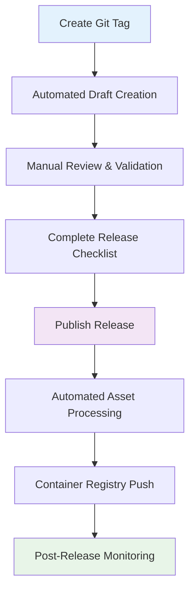

# Release Process

This document describes the GlinrDock release process, versioning, and artifact distribution.

## Release Overview

GlinrDock follows semantic versioning and provides automated release artifacts through GitHub Actions. All releases include multi-platform binaries, checksums, and documentation.

## Versioning Scheme

### Semantic Versioning (SemVer)

GlinrDock uses semantic versioning: `MAJOR.MINOR.PATCH`

- **MAJOR**: Incompatible API changes
- **MINOR**: New features, backward compatible
- **PATCH**: Bug fixes, backward compatible

### Version Examples

- `v1.0.0` - Initial stable release
- `v1.1.0` - New features added
- `v1.1.1` - Bug fixes
- `v2.0.0` - Breaking changes

### Pre-release Versions

- `v1.0.0-alpha.1` - Alpha releases
- `v1.0.0-beta.1` - Beta releases
- `v1.0.0-rc.1` - Release candidates

## Release Schedule

### Regular Releases

- **Major releases**: Every 12-18 months
- **Minor releases**: Every 2-3 months
- **Patch releases**: As needed for critical fixes

### Security Releases

- **Critical vulnerabilities**: Within 24-48 hours
- **High severity**: Within 1 week
- **Medium/Low severity**: Next scheduled release

## Release Artifacts

### Binary Distributions

Each release includes statically-linked binaries for:

| Platform | Architecture | Filename |
|----------|--------------|----------|
| Linux | x86_64 | `glinrdockd_linux_amd64.tar.gz` |
| Linux | ARM64 | `glinrdockd_linux_arm64.tar.gz` |
| macOS | x86_64 | `glinrdockd_darwin_amd64.tar.gz` |
| macOS | ARM64 | `glinrdockd_darwin_arm64.tar.gz` |

### Verification Files

- Individual checksums: `*.tar.gz.sha256`
- Combined checksums: `SHA256SUMS`
- SBOM files: `*.sbom.spdx.json` (when available)

### Installation Scripts

- `install.sh` - Universal installation script
- Docker Compose files in `/deploy` directory

## Release Process

The GlinrDock release process follows a structured **tag → draft → publish** workflow with comprehensive validation at each step.

### Overview: Tag → Draft → Publish Flow



### Step 1: Tag Creation

**Prerequisites:**
- All code changes merged to main branch
- Version updated in source code
- [Release checklist](RELEASE_CHECKLIST.md) initiated

**Create and push tag:**
```bash
# Create annotated tag
git tag -a v1.0.0 -m "Release v1.0.0"

# Push tag to trigger draft creation
git push origin v1.0.0
```

### Step 2: Automated Draft Creation

**Triggered by:** Tag push matching `v*` pattern

**Automated actions:**
- Creates draft GitHub release
- Auto-generates release notes using [.github/release.yml](../.github/release.yml)
- Uploads artifacts from `_staging/$VERSION/` (if present)
- Categorizes changes: Added, Changed, Fixed, Security

**No manual intervention required at this step**

### Step 3: Manual Review and Validation

**Release manager actions:**
1. **Review auto-generated release notes**
   - Verify all significant changes are captured
   - Add context for breaking changes
   - Enhance descriptions for clarity

2. **Complete pre-publication validation**
   - Follow [Release Checklist](RELEASE_CHECKLIST.md) thoroughly
   - Test installation methods on target platforms
   - Verify all artifacts and checksums

3. **Update release notes**
   - Add installation instructions
   - Include migration notes (if applicable)
   - Highlight security fixes prominently

### Step 4: Release Publication

**Trigger:** Manual "Publish release" action in GitHub

**Automated processing on publish:**
- Downloads all public release assets
- Verifies SHA256 checksums against SHA256SUMS
- Extracts Linux binaries (amd64, arm64)
- Builds multi-arch container images
- Pushes to GitHub Container Registry (ghcr.io)
- Runs Trivy security scans
- **Fails build on HIGH/CRITICAL vulnerabilities**

### Step 5: Post-Publication Monitoring

**Immediate verification:**
- [ ] Container images available in GHCR
- [ ] Installation scripts working correctly
- [ ] Documentation site updated
- [ ] No security scan failures

**Ongoing monitoring:**
- GitHub Issues for installation problems
- Download statistics and usage metrics
- Security vulnerability reports

## Release Validation Tools

### Automated Release Notes
The repository uses [.github/release.yml](../.github/release.yml) to automatically generate categorized release notes:

- **🚀 Added**: New features and enhancements
- **🔧 Changed**: Breaking changes and updates  
- **🐛 Fixed**: Bug fixes and corrections
- **🔒 Security**: Security-related changes
- **📦 Dependencies**: Dependency updates
- **🧹 Maintenance**: Internal improvements

**Excluded from highlights:** chore, docs, refactor commits

### Manual Validation Checklist
The comprehensive [Release Checklist](RELEASE_CHECKLIST.md) ensures thorough validation:

- **Build verification**: All platforms and architectures
- **Security compliance**: SBOM, vulnerability scans, dependency review
- **Installation testing**: Ubuntu, Debian, RHEL, container deployments
- **Documentation updates**: Installation guides, breaking changes, security advisories
- **Post-release monitoring**: Registry verification, issue tracking

**Both tools must be used together** - auto-generated notes provide the foundation, while the manual checklist ensures quality and security standards.

## Build Process

### Cross-Compilation

Binaries are built with:
```bash
CGO_ENABLED=0 GOOS=$os GOARCH=$arch go build \
  -ldflags "-s -w -X main.version=$VERSION -X main.buildTime=$BUILD_TIME" \
  -o glinrdockd_${os}_${arch} ./cmd/glinrdockd
```

### Build Flags

- `CGO_ENABLED=0`: Static linking
- `-s -w`: Strip symbols for smaller size
- `-X`: Embed version information

### Artifact Packaging

```bash
# Create tarball
tar -czf glinrdockd_${os}_${arch}.tar.gz glinrdockd_${os}_${arch}

# Generate checksum
sha256sum glinrdockd_${os}_${arch}.tar.gz > glinrdockd_${os}_${arch}.tar.gz.sha256
```

## CI/CD Configuration

### GitHub Actions Workflow

The release process uses two workflow paths:

#### Path A: Tag Push (Draft Release Creation)
When a version tag (v*) is pushed:
- Creates a draft GitHub release
- Uploads artifacts from `_staging/$VERSION/` if present
- Requires no external secrets beyond `GITHUB_TOKEN`

#### Path B: Release Published (Asset Processing)
When a draft release is published:
- Downloads all public release assets
- Verifies checksums (SHA256SUMS)
- Builds multi-arch container images (linux/amd64, linux/arm64)
- Pushes images to GitHub Container Registry (GHCR)
- Runs Trivy security scans (filesystem and container)
- Fails on HIGH/CRITICAL vulnerabilities

```yaml
name: Release
on:
  push:
    tags: ['v*']
  release:
    types: ['published']

permissions:
  contents: write
  packages: write

jobs:
  draft-release:
    if: github.repository_owner == 'GLINCKER' && startsWith(github.ref, 'refs/tags/v')
    # Creates draft release and uploads staging artifacts

  publish-release:
    if: github.repository_owner == 'GLINCKER' && github.event_name == 'release'
    # Downloads assets, verifies, builds containers, scans
```

### Security Considerations

- **Build environment**: Isolated GitHub Actions runners
- **Minimal permissions**: Only `contents:write` and `packages:write`
- **Action pinning**: All actions pinned by commit SHA
- **Fork protection**: Guards prevent execution on forked repositories
- **No external secrets**: Uses only `GITHUB_TOKEN` for authentication
- **Supply chain security**: SBOM generation and Trivy vulnerability scanning
- **Artifact verification**: Automated checksum validation

## Provenance and Attestation

### SLSA Build Provenance

Future releases will include SLSA (Supply-chain Levels for Software Artifacts) provenance:

```bash
# Verify provenance (future feature)
cosign verify-attestation \
  --type slsaprovenance \
  --certificate-identity-regexp=https://github.com/GLINCKER/glinrdock-release/.github/workflows/release.yml@refs/tags/v \
  --certificate-oidc-issuer=https://token.actions.githubusercontent.com \
  glinrdockd_linux_amd64.tar.gz
```

### Build Reproducibility

- **Deterministic builds**: Same source produces identical binaries
- **Build environment**: Documented and reproducible
- **Dependency locking**: Go modules with checksum verification

## Release Notes

### Format Template

```markdown
# GlinrDock v1.0.0

## Breaking Changes
- List any breaking changes
- Migration instructions

## New Features
- Feature 1 description
- Feature 2 description

## Improvements
- Performance improvements
- User experience enhancements

## Bug Fixes
- Fix 1 description
- Fix 2 description

## Security Updates
- Security issue 1 (if applicable)
- CVE references

## Installation
[Standard installation instructions]

## Checksums
[SHA256 checksums for verification]
```

### Content Guidelines

- **Clear descriptions** of changes
- **Migration instructions** for breaking changes
- **Security information** prominently displayed
- **Installation verification** steps
- **Known issues** and workarounds

## Distribution Channels

### Primary Distribution

- **GitHub Releases**: Official release artifacts
- **Container Registry**: Docker images at `ghcr.io/glincker/glinrdock`
  - Versioned tags: `ghcr.io/glincker/glinrdock:v1.0.0`
  - Latest tag: `ghcr.io/glincker/glinrdock:latest` (stable releases only)

### Package Managers (Future)

Planned support for:
- **Homebrew** (macOS/Linux)
- **APT repository** (Debian/Ubuntu)
- **RPM repository** (RHEL/CentOS)
- **Snap packages** (Universal Linux)

### CDN Distribution

Installation scripts and binaries are distributed via:
- GitHub Releases (primary)
- GitHub raw content (installation scripts)

## Version Support Policy

### Support Timeline

- **Current major version**: Full support
- **Previous major version**: Security updates for 12 months
- **Older versions**: Community support only

### End of Life (EOL) Process

1. **EOL announcement**: 90 days before EOL
2. **Final security release**: If vulnerabilities found
3. **Documentation update**: Mark version as unsupported
4. **Support removal**: No further updates or support

## Quality Assurance

### Pre-release Testing

- **Unit tests**: Automated test suite
- **Integration tests**: Multi-platform testing
- **Security scanning**: Vulnerability assessment
- **Performance testing**: Regression testing

### Release Validation

- **Installation testing**: All installation methods
- **Upgrade testing**: From previous versions
- **Rollback testing**: Ensure rollback procedures work
- **Documentation verification**: All links and examples

## Communication

### Release Announcements

- **GitHub Releases**: Primary announcement
- **Security advisories**: For security releases
- **Email notifications**: For critical updates

### Notification Channels

- GitHub release notifications (recommended)
- GitHub security advisories
- Project documentation updates

## Troubleshooting Releases

### Common Issues

**Build failures:**
- Check Go version compatibility
- Verify dependency availability
- Review build environment

**Checksum mismatches:**
- Verify file integrity
- Check network issues during download
- Validate build process

**Installation failures:**
- Test installation scripts
- Verify binary permissions
- Check system compatibility

### Support Process

1. **Check known issues** in release notes
2. **Verify installation** following documentation
3. **Report issues** on GitHub with full details
4. **Emergency hotfixes** for critical issues

## Release Metrics

### Success Criteria

- All platform builds successful
- Checksum verification passes
- Installation scripts tested
- Documentation complete
- Zero critical security issues

### Post-release Monitoring

- Download statistics
- Issue reports
- Performance metrics
- User feedback

For questions about the release process, contact the development team through GitHub issues or discussions.